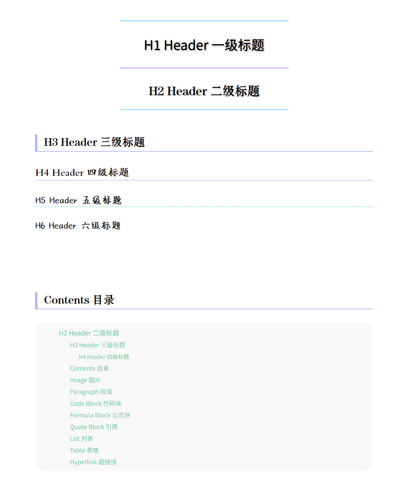
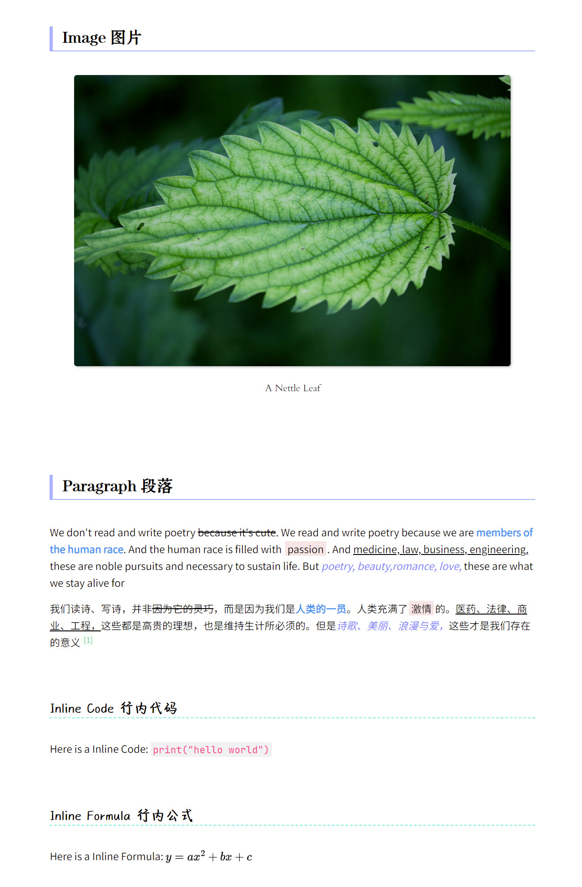
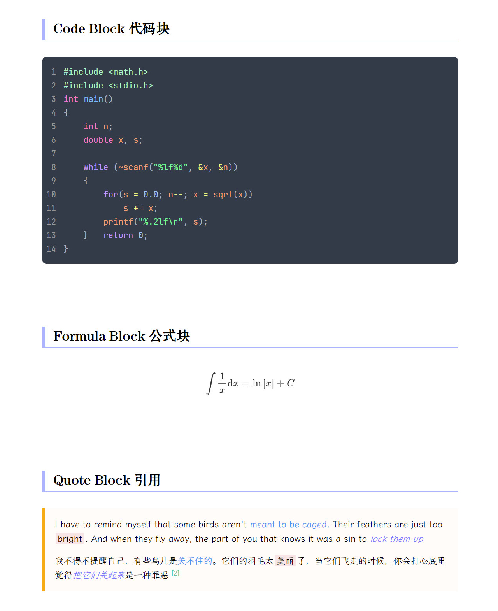
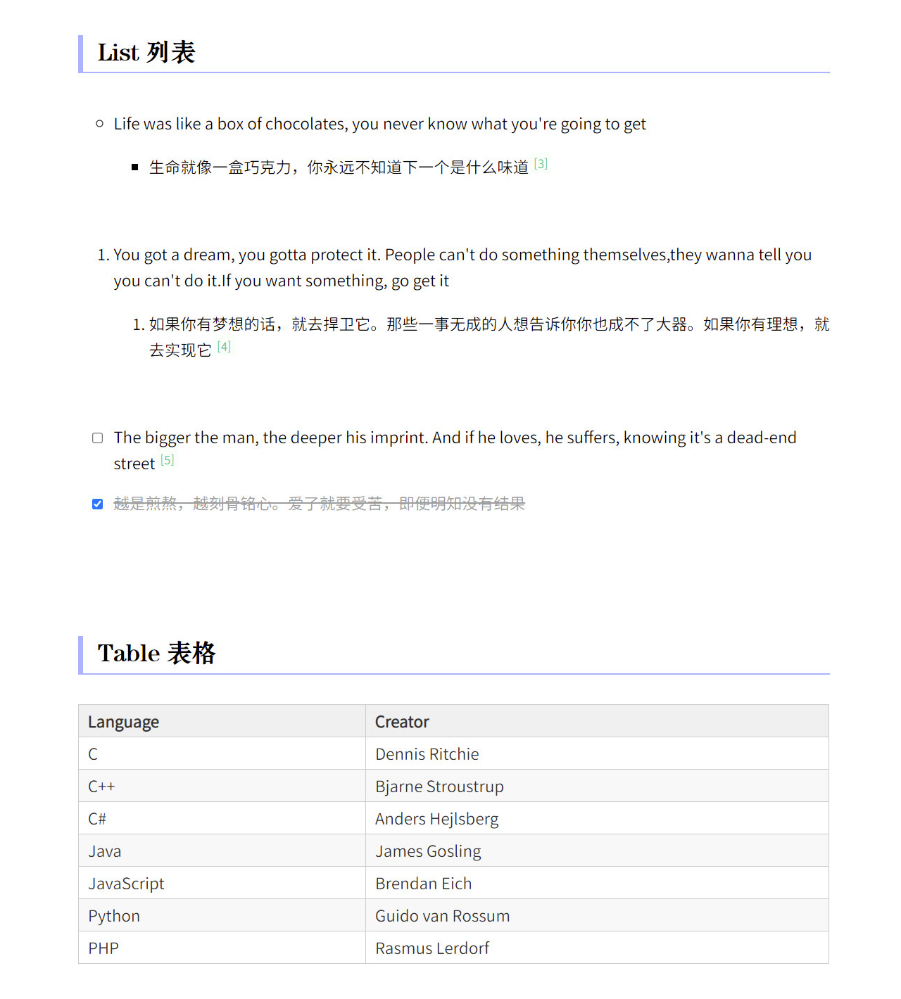
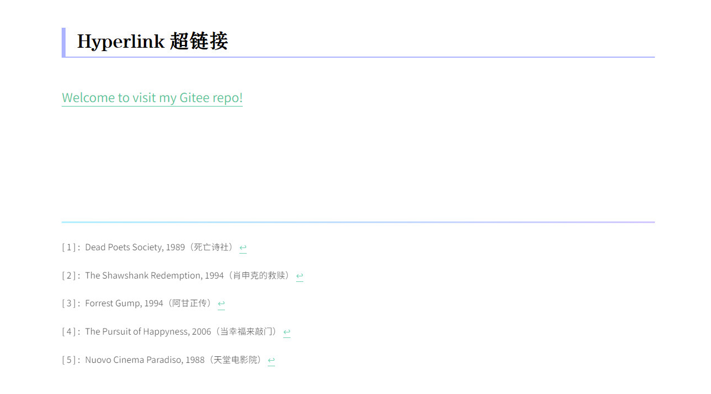

# Typora Rainbow Theme

 

中文说明文档请见 [README.md](README.md)

 

> **Rainbow** is a simple and beautiful Typora theme suitable for Both Chinese and English, inpired by [Maize](https://github.com/BEATREE/typora-maize-theme) and [Liquid](https://github.com/Fentaniao/Liquid)

 

 

## Screenshots of old version

 

 

 

 

## Screenshots of new version

 

 

 

 

 

 

## How to install Rainbow

  1. Download and install the three required fonts `JetBrains Mono NL`[^1], `LXGW Wen Kai`[^2], `Resource Han Rounded CN Normal` , `方正北魏楷书简体` , `方正宋黑简体` , `今天我又想你啦` and `浅喜深爱`[^3]. You can download my package from the `fonts` folder, or you can download the latest version yourself from the website.

  2. Download `rainbow.css`.

  3. Open Typora. Click `Open Theme Folder` button from **File** → **Preference** → **Appearance** section.

  4. Put downloaded CSS files into the opened folder. Make sure your CSS files are directly under that directory!

  5. Restart your Typora, then click **Themes** to choose Rainbow. Enjoy it ~

 

[^1]:<https://www.jetbrains.com/lp/mono/>

[^2]:<https://github.com/lxgw/LxgwWenKai>
[^3]:<https://www.foundertype.com/index.php/FindFont/index>

