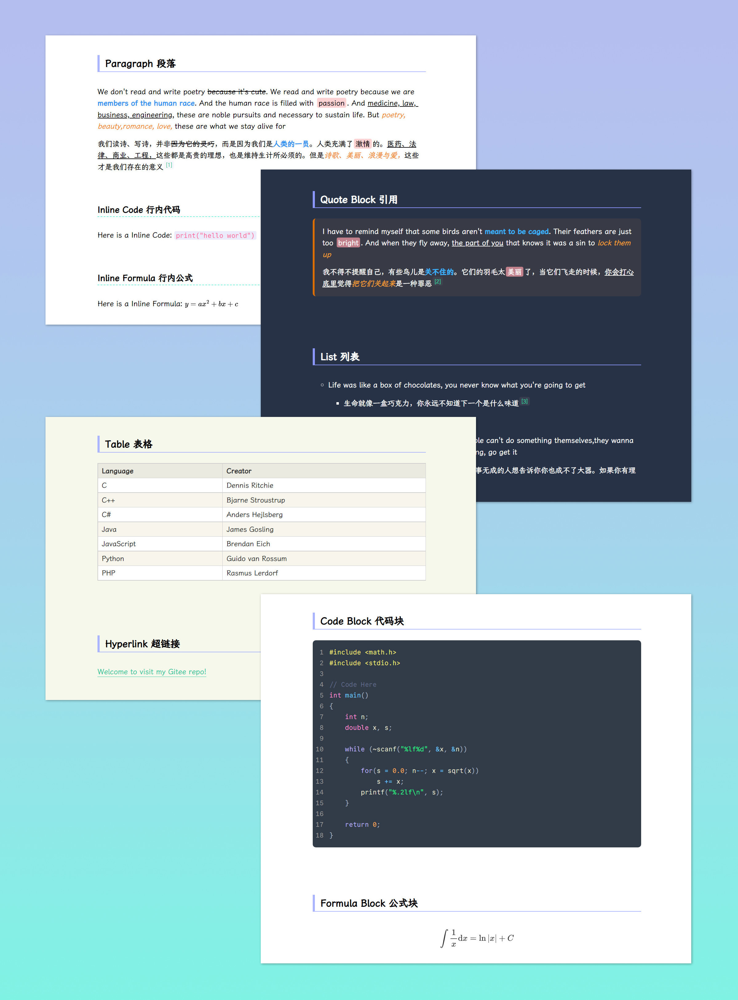
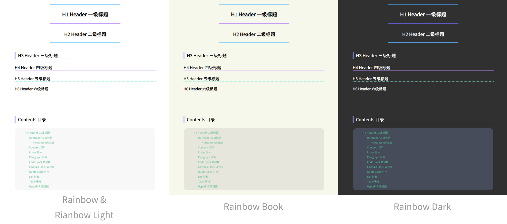
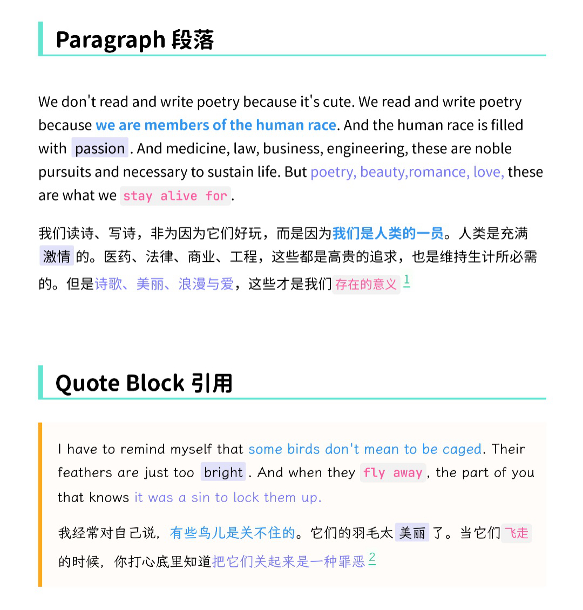
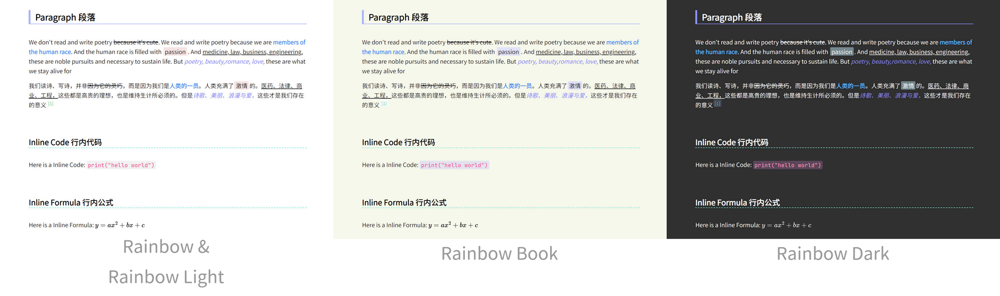
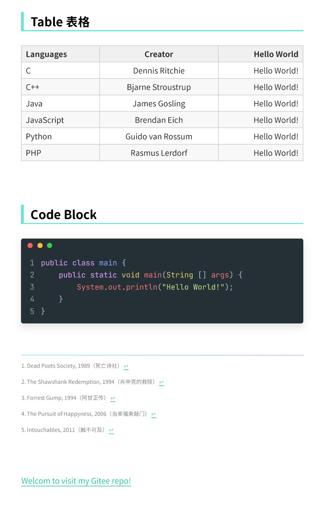
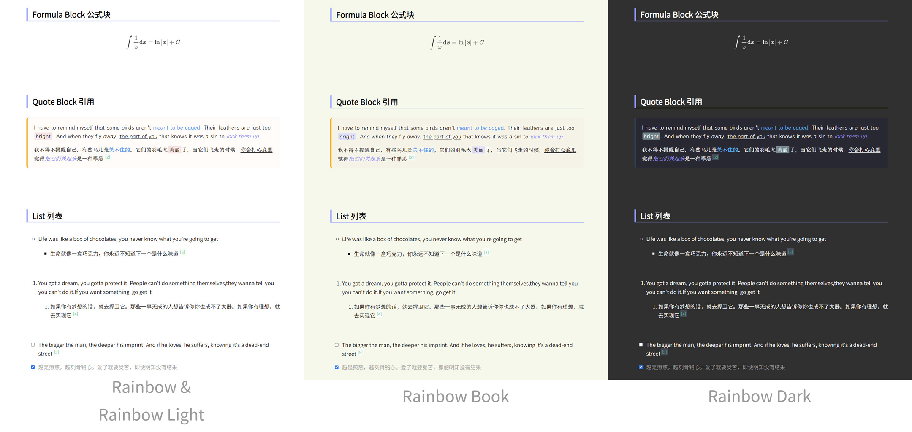
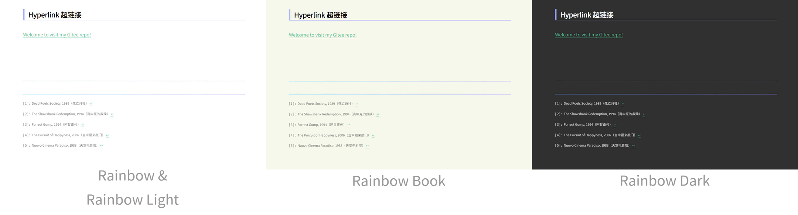

# Typora Rainbow 主题

 

For English documentation, please see [README.en.md](README.en.md)

 

> **Rainbow** 是一个简洁美观的、适用于中文和英文的 Typora 主题, 其代码基于 [Maize](https://github.com/BEATREE/typora-maize-theme) 和 [Liquid](https://github.com/Fentaniao/Liquid)

 

 

## 通知！

Rainbow 主题已更新多种色彩版本，欢迎下载体验哦 ✧(≖ ◡ ≖✿)

 

 

## 截图

> 点击图片可查看大图

 

 

 

 

 

 

 

## 如何安装 Rainbow

  1. 下载并安装所需的三款字体 `JetBrains Mono NL`[^1]、`LXGW Wen Kai`[^2]、`Resource Han Rounded CN Normal` 。你可以下载我的 `fonts` 文件夹中的字体压缩包，也可以从网站下载最新版本的字体

  2. 下载文件 `rainbow.css`

  3. 打开 Typora，点击 **文件** → **偏好设置** → **外观** 窗口下的 `打开主题文件夹`

  4. 将下载的 CSS 文件放入打开的文件夹中。注意要确保你的 CSS 文件在该目录中（而非其子目录）！

  5. 重启 Typora，点击 **主题** 菜单并选择 Rainbow。祝使用愉快 ~

 

[^1]:<https://www.jetbrains.com/lp/mono/>

[^2]:<https://github.com/lxgw/LxgwWenKai>

