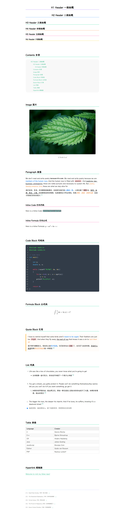

# Typora Rainbow Themes

 

> **Rainbow** is a suite of simple and colorful Typora themes for Chinese and English, inpired by [Maize](https://github.com/BEATREE/typora-maize-theme) and [Liquid](https://github.com/Fentaniao/Liquid)

 

 

## Notice!

Rainbow Themes has been updated with multicolor version. Welcome to download and experience them ✧(≖ ◡ ≖✿)

 

 

## Screenshots

 

**Rainbow Book**

 

**Rainbow Light**

 

**Rainbow**

 

**Rainbow Dark**

 

 

## How to use

  1. Download and install the required fonts [JetBrains Mono NL](https://www.jetbrains.com/lp/mono/) and [LXGW ZhenKai](https://github.com/lxgw/LxgwZhenKai). You can download my backup from the `fonts` folder, or you can download the latest version yourself from the website.

  2. Pick a color theme you like and download the corresponding CSS file.

  3. Open Typora. Click `Open Theme Folder` button from **File** → **Preference** → **Appearance** section.

  4. Put the CSS files into the opened folder. Make sure your CSS files are directly under that directory!

  5. Restart your Typora, then click **Themes** to choose Rainbow. Enjoy it ~

 

 

 

 

