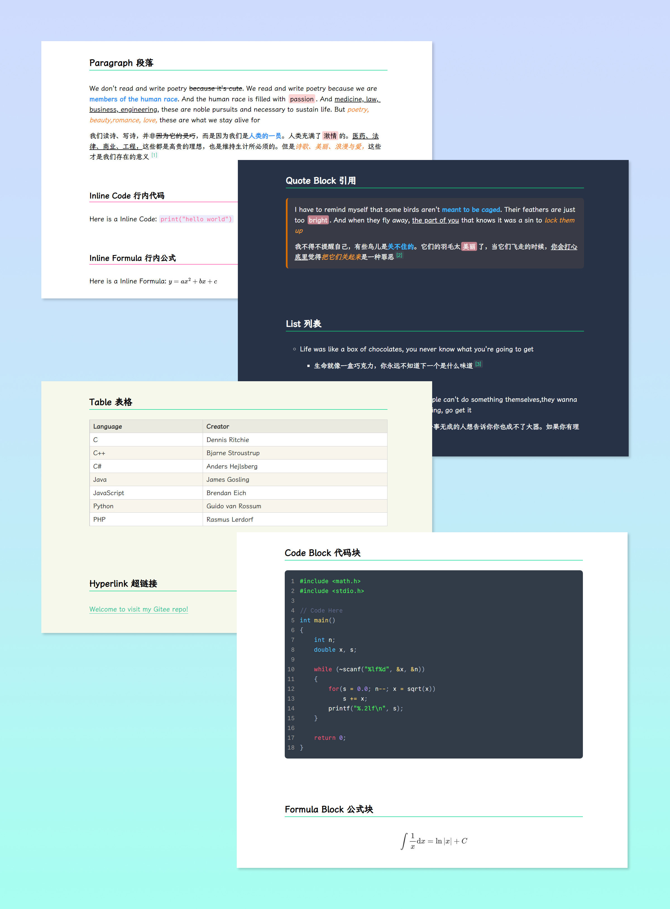

# Typora Rainbow Themes

 

> **Rainbow** is a suite of simple and colorful Typora themes for Chinese and English, inpired by [Maize](https://github.com/BEATREE/typora-maize-theme) and [Liquid](https://github.com/Fentaniao/Liquid).

 

 

## Notice!

Rainbow Themes has been updated with multicolor version. Welcome to download and enjoy them ✧(≖ ◡ ≖✿)

 

### Release 2025.02

1. Simplify the header style.
2. Modify the code block theme refer to [Monokai](https://monokai.pro/) to improve readability.
3. Adjust the color of some text.

 

 

## Screenshots

 

**Rainbow Book**

 

**Rainbow Light**

 

**Rainbow**

 

**Rainbow Dark**

 

 

## How to use

  1. Download and install the required fonts [CommitMono Nerd Font](https://github.com/ryanoasis/nerd-fonts) and [LXGW ZhenKai](https://github.com/lxgw/LxgwZhenKai).

  2. Pick a color theme you like and download the corresponding CSS file.

  3. Open Typora → **File** → **Preference** → **Appearance** → Click `Open Theme Folder` button.

  4. Put the CSS files into the opened folder.

  5. Restart your Typora, then click **Themes** to choose Rainbow.

 

 

 

 

